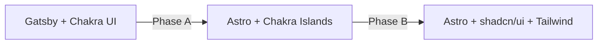
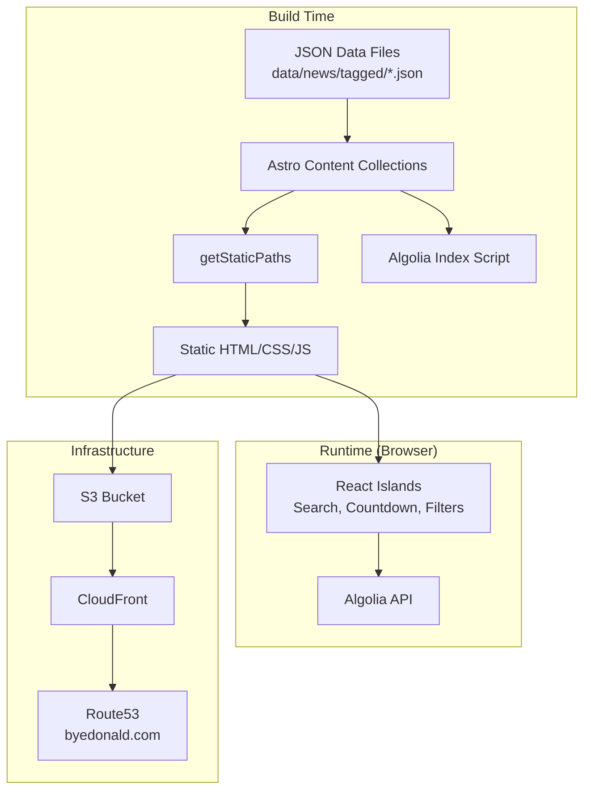
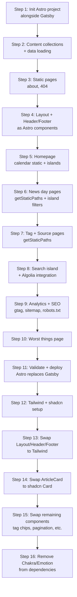

# Design Document: Gatsby to Astro + shadcn/ui Migration

## Overview

This design describes a two-phase migration of byedonald.com from Gatsby 5 + Chakra UI v2 to Astro + shadcn/ui + Tailwind CSS. The site is a static news archive generating ~1,150 pages from JSON data, deployed to S3/CloudFront.

**Migration philosophy:** The site must remain deployable at every step. We achieve this by:

1. **Phase A — Framework swap:** Replace Gatsby with Astro, keeping all existing React+Chakra components running as Astro islands. This validates routing, data loading, and deployment without touching styling.
2. **Phase B — UI library swap:** Replace Chakra UI components with shadcn/ui + Tailwind equivalents, one component at a time. Each component replacement is independently revertible.



**Key design decisions:**
- Astro content collections replace GraphQL for typed data access
- `getStaticPaths()` replaces `gatsby-node.js` for programmatic page generation
- Interactive components (Search, Countdown, news-day filters) become React islands with `client:load`
- Static components (Layout, Header, Footer, calendar grids) become Astro components
- The existing CDK stack and S3 sync deployment remain unchanged

## Architecture

### High-Level System Architecture



### Migration Phase Architecture

**Phase A — Astro with Chakra Islands:**
- Astro handles routing, page generation, and static rendering
- Existing React+Chakra components run unchanged inside `client:load` / `client:visible` islands
- Chakra's CSS-in-JS (Emotion) loads per-island; acceptable as a transitional step
- All ~1,150 pages generated via content collections + `getStaticPaths()`

**Phase B — shadcn/ui Replacement:**
- Layout/Header/Footer converted to pure Astro components with Tailwind classes
- Article cards, tag chips, pagination become shadcn/ui components
- Dark mode switches from Chakra's `useColorModeValue` to Tailwind `dark:` variants with class-based toggling
- Islands that remain interactive (Search, Countdown, news-day filters) get shadcn/ui equivalents

## Components and Interfaces

### Directory Structure (Astro Project)

```
/
├── astro.config.mjs
├── tailwind.config.ts
├── tsconfig.json
├── package.json
├── .env.sample
├── src/
│   ├── content/
│   │   └── config.ts              # Content collection schemas
│   ├── layouts/
│   │   └── BaseLayout.astro       # Full-page layout (header + main + footer)
│   ├── components/
│   │   ├── Header.astro           # Static header (Phase B)
│   │   ├── Footer.astro           # Static footer (Phase B)
│   │   ├── ThemeToggle.astro      # Dark mode toggle (inline script)
│   │   ├── MonthGrid.astro        # Static calendar month grid
│   │   ├── ArticleCard.astro      # Static article card (Phase B)
│   │   ├── TagChip.astro          # Static tag badge
│   │   └── react/                 # React island components
│   │       ├── Search.tsx         # Algolia search (client:load)
│   │       ├── Countdown.tsx      # Live countdown timer (client:load)
│   │       ├── NewsDayFilters.tsx  # Tag/source/author filter controls (client:load)
│   │       └── WorstThings.tsx    # Worst things interactive view (client:load)
│   ├── pages/
│   │   ├── index.astro            # Homepage (calendar + countdown + search)
│   │   ├── about.astro            # About page (pure static)
│   │   ├── 404.astro              # 404 page (pure static)
│   │   ├── worst-things.astro     # Worst things page
│   │   ├── news/
│   │   │   └── [date].astro       # Dynamic news day pages
│   │   ├── tags/
│   │   │   ├── index.astro        # Tags index
│   │   │   └── [slug].astro       # Individual tag pages
│   │   └── sources/
│   │       ├── index.astro        # Sources index
│   │       └── [slug].astro       # Individual source pages
│   ├── utils/
│   │   ├── slugify.ts             # Shared slugify function (unchanged)
│   │   ├── tags.ts                # Tag lookup utilities (unchanged)
│   │   └── env.ts                 # Environment variable validation
│   ├── types/
│   │   └── news.ts                # Article/Source interfaces (unchanged)
│   └── styles/
│       └── globals.css            # Tailwind directives + custom properties
├── data/                           # Unchanged — JSON data files
├── cdk/                            # Unchanged — CDK infrastructure
├── scripts/                        # Unchanged — data pipeline scripts
└── public/
    ├── algolia.png                # Static assets
    └── backgrounds/               # Background images
```

### Component Classification

| Component | Current (Gatsby) | Target (Astro) | Hydration |
|-----------|-----------------|----------------|-----------|
| Layout | React (Chakra) | Astro component | None (static) |
| Header | React (Chakra) | Astro component | None (static) |
| Footer | React (Chakra) | Astro component | None (static) |
| ThemeToggle | React (Chakra useColorMode) | Astro + inline `<script>` | Inline script |
| MonthGrid/Calendar | React (Chakra) | Astro component | None (static) |
| Countdown | React (useState + setInterval) | React island | `client:load` |
| Search | React (Algolia InstantSearch) | React island | `client:load` |
| NewsDayFilters | React (useState, URL sync) | React island | `client:load` |
| TagLegend | React (Chakra) | React island (within NewsDayFilters) | `client:load` |
| PaginationControls | React (Chakra) | React island (within page context) | `client:load` |
| ArticleCard | React (Chakra Card) | Astro component (shadcn Card) | None (static) |
| WorstThings | React (interactive) | React island | `client:load` |

### Key Interfaces

```typescript
// src/utils/env.ts — Environment variable validation
interface EnvConfig {
  PUBLIC_ALGOLIA_APP_ID: string;
  PUBLIC_ALGOLIA_API_KEY: string;
  PUBLIC_ALGOLIA_INDEX_NAME: string;
}

export function validateEnv(): EnvConfig {
  const required = [
    'PUBLIC_ALGOLIA_APP_ID',
    'PUBLIC_ALGOLIA_API_KEY', 
    'PUBLIC_ALGOLIA_INDEX_NAME'
  ];
  const missing = required.filter(k => !import.meta.env[k]);
  if (missing.length > 0) {
    throw new Error(`Missing required environment variables: ${missing.join(', ')}`);
  }
  return {
    PUBLIC_ALGOLIA_APP_ID: import.meta.env.PUBLIC_ALGOLIA_APP_ID,
    PUBLIC_ALGOLIA_API_KEY: import.meta.env.PUBLIC_ALGOLIA_API_KEY,
    PUBLIC_ALGOLIA_INDEX_NAME: import.meta.env.PUBLIC_ALGOLIA_INDEX_NAME,
  };
}
```

```typescript
// src/content/config.ts — Content collection schema
import { defineCollection, z } from 'astro:content';

const newsCollection = defineCollection({
  type: 'data',
  schema: z.object({
    status: z.string().optional(),
    totalResults: z.number().optional(),
    articles: z.array(z.object({
      source: z.object({
        id: z.string().nullable(),
        name: z.string(),
      }),
      author: z.string().nullable(),
      title: z.string(),
      description: z.string().nullable(),
      url: z.string(),
      urlToImage: z.string().nullable(),
      publishedAt: z.string(),   // ISO 8601
      content: z.string().nullable(),
      tags: z.array(z.string()),
      publishedAtTs: z.number(),
    })),
  }),
});

export const collections = { news: newsCollection };
```

### Page Generation Strategy

```typescript
// src/pages/news/[date].astro — getStaticPaths example
import { getCollection } from 'astro:content';

export async function getStaticPaths() {
  const allNews = await getCollection('news');
  return allNews.map(entry => ({
    params: { date: entry.id },  // filename without extension
    props: { 
      articles: entry.data.articles.filter(a => !a.tags.includes('off_topic'))
    },
  }));
}
```

```typescript
// src/pages/tags/[slug].astro — Tag pages
import { getCollection } from 'astro:content';
import { slugify } from '../../utils/slugify';

export async function getStaticPaths() {
  const allNews = await getCollection('news');
  const tagArticleMap = new Map<string, Article[]>();
  
  for (const entry of allNews) {
    for (const article of entry.data.articles) {
      if (article.tags.includes('off_topic')) continue;
      for (const tag of article.tags) {
        if (!tagArticleMap.has(tag)) tagArticleMap.set(tag, []);
        tagArticleMap.get(tag)!.push(article);
      }
    }
  }
  
  return Array.from(tagArticleMap.entries()).map(([tagId, articles]) => ({
    params: { slug: slugify(tagId) },
    props: { tagId, articles },
  }));
}
```

## Data Models

### Content Collection: News

**Source:** `data/news/tagged/*.json` (symlinked or referenced via content collection config)
**Collection name:** `news`
**Loader:** JSON data collection (`type: 'data'`)

Each file represents one day's news. The entry ID is derived from the filename (e.g., `2023-01-01`).

```typescript
// Article schema (matches existing TypeScript interface)
interface Article {
  source: { id: string | null; name: string };
  author: string | null;
  title: string;
  description: string | null;
  url: string;
  urlToImage: string | null;
  publishedAt: string;      // ISO 8601 datetime
  content: string | null;
  tags: string[];
  publishedAtTs: number;    // Unix timestamp (seconds)
}

// File schema (top-level structure of each JSON file)
interface NewsDay {
  status?: string;
  totalResults?: number;
  articles: Article[];
}
```

### Content Collection: Tags

**Source:** `data/tags/tags.json`
**Usage:** Imported directly (not a content collection) — small static file used for tag metadata lookups.

```typescript
interface TagCategory {
  title: string;
  description: string;
  color: string;
  tags: Array<{ id: string; name: string; description: string }>;
}
```

### Environment Variable Mapping

| Gatsby Variable | Astro Variable | Context | Purpose |
|----------------|---------------|---------|---------|
| `GATSBY_ALGOLIA_APP_ID` | `PUBLIC_ALGOLIA_APP_ID` | Client | Algolia app identifier |
| `GATSBY_ALGOLIA_API_KEY` | `PUBLIC_ALGOLIA_API_KEY` | Client | Algolia search-only key |
| `GATSBY_ALGOLIA_INDEX_NAME` | `PUBLIC_ALGOLIA_INDEX_NAME` | Client | Algolia index name |
| `ALGOLIA_API_KEY` | `ALGOLIA_API_KEY` | Server/build only | Algolia admin key (indexing) |

### Routing Strategy

| URL Pattern | Astro File | Data Source |
|-------------|-----------|-------------|
| `/` | `src/pages/index.astro` | News collection (date list) |
| `/news/[date]/` | `src/pages/news/[date].astro` | Single news day entry |
| `/tags/` | `src/pages/tags/index.astro` | All unique tags across articles |
| `/tags/[slug]/` | `src/pages/tags/[slug].astro` | Articles matching tag |
| `/sources/` | `src/pages/sources/index.astro` | All unique source names |
| `/sources/[slug]/` | `src/pages/sources/[slug].astro` | Articles matching source |
| `/about` | `src/pages/about.astro` | Static content |
| `/worst-things/` | `src/pages/worst-things.astro` | worst-things data |
| `/404` | `src/pages/404.astro` | Static content |

### Build and Deployment Changes

**Build command:** `astro build` (replaces `gatsby build`)
**Output directory:** `dist/` (Astro default, replacing Gatsby's `public/`)
**Deploy command update:**
```json
{
  "deploy": "aws s3 sync ./dist/ s3://byedonald3stack-websitebucket75c24d94-qo97w51klbe9 --delete"
}
```

**Asset hashing:** Astro produces content-hashed filenames for CSS/JS bundles by default (`_astro/` directory), compatible with CloudFront's CACHING_OPTIMIZED policy.

**Error page:** The 404.astro page renders to `dist/404.html`. An additional build step copies/symlinks it to `dist/error.html` to match the S3 website hosting config expecting `error.html`.

**Sitemap:** `@astrojs/sitemap` integration with `site: 'https://byedonald.com'`
**Robots.txt:** Custom `public/robots.txt` or generated via integration

### Migration Sequence



**Step validation at each point:**
1. `astro build` exits with code 0
2. Page count is within ±5 of baseline
3. Smoke test hits key pages for 200 status + expected content elements

## Correctness Properties

*A property is a characteristic or behavior that should hold true across all valid executions of a system — essentially, a formal statement about what the system should do. Properties serve as the bridge between human-readable specifications and machine-verifiable correctness guarantees.*

### Property 1: Slugify produces valid URL slugs

*For any* non-empty string input, `slugify(input)` SHALL produce a string that matches the regex `^[a-z0-9]+(-[a-z0-9]+)*$` (lowercase alphanumeric segments separated by single hyphens, with no leading or trailing hyphens), OR an empty string when the input contains no alphanumeric characters.

**Validates: Requirements 3.2, 3.3**

### Property 2: Slugify is idempotent

*For any* string input, applying slugify twice SHALL produce the same result as applying it once: `slugify(slugify(input)) === slugify(input)`.

**Validates: Requirements 3.2, 3.3**

### Property 3: Off-topic article filtering

*For any* array of articles where some articles have `"off_topic"` in their `tags` array, the filtered result SHALL contain zero articles with `"off_topic"` in their tags, AND shall contain all articles that do NOT have `"off_topic"` in their tags.

**Validates: Requirements 2.4, 3.5**

### Property 4: Article schema validation round-trip

*For any* valid article object conforming to the Article interface (with all required fields present and correctly typed), serializing to JSON and parsing through the Zod schema SHALL succeed. For any object missing a required field or with an incorrectly typed field, validation SHALL fail.

**Validates: Requirements 2.3**

### Property 5: News-day filter state URL round-trip

*For any* combination of active tag IDs, active source names, active author names, and sort order (newest/oldest), serializing the filter state to URL query parameters (`t`, `s`, `a`, `o`) and then deserializing from those parameters SHALL produce an equivalent filter state.

**Validates: Requirements 4.3**

### Property 6: News-day page title generation

*For any* valid date string in `YYYY-MM-DD` format, the title generation function SHALL produce a string matching the pattern `"Trump News for {weekday}, {month} {day}, {year}"` where the date parts correspond to the input date interpreted in local time.

**Validates: Requirements 9.4**

## Error Handling

### Build-Time Errors

| Error Condition | Handling Strategy |
|----------------|-------------------|
| Missing env variable | `validateEnv()` throws at build start with clear message listing missing vars |
| Invalid JSON schema | Astro content collection fails build with file path + validation error |
| Slug collision | Log warning at build time; slugify is deterministic so this indicates duplicate source data |

### Runtime Errors (Islands)

| Error Condition | Handling Strategy |
|----------------|-------------------|
| Algolia connection failure | Search component shows "Search unavailable" message; page remains functional |
| Missing Algolia env vars | Search component shows informational message with env variable diagnostics |
| Image load failure | `onError` handler swaps to SVG placeholder (existing pattern preserved) |
| Invalid URL parameters | Filter state deserialization defaults to empty sets; page renders normally |

### Deployment Errors

| Error Condition | Handling Strategy |
|----------------|-------------------|
| Build exceeds 180s | Log warning with duration and page count; build still succeeds |
| Page count drift > ±5 | Smoke test fails, blocking deployment |
| Missing error.html | Post-build step creates error.html from 404.html; fails if 404.html is missing |

## Testing Strategy

### Unit Tests (Example-Based)

Unit tests cover specific examples, edge cases, and integration points:

- **Static page output:** Verify about/404 pages contain zero `<script>` tags
- **Calendar grid:** Verify correct day links for a known month/year with known data
- **Layout structure:** Verify all pages include header, main, footer elements
- **Env validation:** Verify build fails with clear error when env vars are missing
- **Title generation:** Verify specific date → title mappings (e.g., "2023-01-01" → "Trump News for Sunday, January 1, 2023")
- **Error.html generation:** Verify 404.html is copied to error.html in output

### Property-Based Tests

Property tests verify universal correctness properties across randomized inputs. Using **fast-check** as the PBT library (already well-suited for TypeScript projects).

Configuration:
- Minimum 100 iterations per property test
- Each property test references its design document property
- Tag format: `Feature: gatsby-to-astro-shadcn-migration, Property {N}: {description}`

Properties to implement:
1. **Slugify validity** — Generate random strings, verify output regex
2. **Slugify idempotence** — Generate random strings, verify `f(f(x)) === f(x)`
3. **Off-topic filtering** — Generate random article arrays with varying tags, verify filter correctness
4. **Schema validation** — Generate valid/invalid article objects, verify accept/reject
5. **URL filter round-trip** — Generate random filter states, verify serialization round-trip
6. **Title generation** — Generate random valid dates, verify title format

### Integration / Smoke Tests

- **Page count validation:** After each migration step, compare generated page count to baseline
- **Key page smoke test:** Hit homepage, a news-day page, a tag page, a source page, and search — verify 200 + expected content element
- **Build-to-deploy pipeline:** Run `astro build` → `s3 sync` → verify CloudFront serves pages
- **Algolia indexing:** Run index script, verify records appear in Algolia
- **URL parity:** Compare full URL lists between Gatsby and Astro builds

### Visual Regression Tests

- Capture screenshots before/after each Chakra → shadcn component swap
- Compare at mobile (375px), tablet (768px), and desktop (1280px) viewports
- Flag any layout shift or spacing difference exceeding 2px threshold

